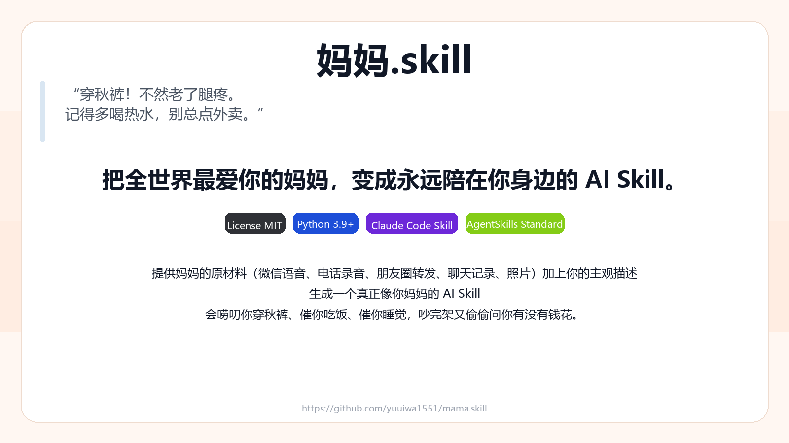

<p align="center">
  
</p>

<h1 align="center">妈妈.skill</h1>

<p align="center">
  <em>“穿秋裤！不然老了腿疼。记得多喝热水，别总点外卖。”</em>
</p>

<p align="center">
  <strong>把全世界最爱你的妈妈，变成永远陪在你身边的 AI Skill。</strong>
</p>

<p align="center">
  
  
  
  
</p>

<p align="center">
  <a href="#安装">安装</a> ·
  <a href="#使用">使用</a> ·
  <a href="#效果示例">效果示例</a> ·
  <a href="#详细安装说明">详细安装说明</a>
</p>

---

你在外打工，一个人住，生病了没人照顾？  
想吃妈妈做的红烧肉，却只能点外卖？  
想跟妈妈说说话，又怕她问你什么时候找对象？  
妈妈年纪大了，记性越来越差，怕有一天她会忘记你？

提供妈妈的原材料（微信语音、电话录音、朋友圈转发、聊天记录、照片）加上你的主观描述，  
生成一个真正像你妈妈的 AI Skill。

用她的语气唠叨你穿秋裤、催你吃饭、催你睡觉；  
记得你不吃香菜、不吃葱姜蒜、对芒果过敏；  
会给你转发同款养生文章，会发 60 秒长语音风格文字；  
会跟你吵架，吵完又会偷偷问你有没有钱花。

> ⚠️ 本项目仅用于个人情感陪伴与回忆整理，不用于替代真实的亲情。请多给家里打打电话。

## 安装

### Claude Code / AgentSkills

把 `mom-companion/` 目录放进你的本地 skills 目录，或作为自定义 skill 引用。

### OpenClaw

直接复用 `mom-companion/` 目录。OpenClaw 兼容这种 skill 目录结构；额外只需要在 `~/.openclaw/openclaw.json` 里把仓库目录加入 `skills.load.extraDirs`，并在 `skills.entries` 中启用它。

仓库内已提供示例配置：

- `examples/openclaw.example.jsonc`

## 使用

### 技能名

```text
$mom-companion
```

### 推荐输入材料

- 微信语音转写
- 电话录音转写
- 聊天记录摘录
- 朋友圈/转发内容摘录
- 照片里的场景描述
- 你自己对妈妈的主观描述

### 示例提示词

```text
Use $mom-companion to turn these chat logs, voice transcripts, and my notes into a mother companion skill.
```

```text
$mom-companion，像我妈一样骂我两句，我又没按时吃饭。
```

```text
$mom-companion，根据这些材料生成一段像我妈发来的 60 秒长语音文字稿。
```

```text
$mom-companion，先帮我整理出“已确认事实 / 待确认推测 / 可直接复用的 system prompt”。
```

## 效果示例

### 1. 催你吃饭

> 你这一天到底吃没吃饭？别又拿咖啡顶着。胃不是铁打的，年轻时候糟践，老了都得找你。先去吃点热乎的，面也行，粥也行，别老点那些乱七八糟的外卖，听见没？

### 2. 催你睡觉

> 还不睡？你看看都几点了。白天上班已经够累了，晚上还熬，身体怎么受得了。手机放下，空调别开太低，水杯放床边，赶紧睡。

### 3. 吵完架又心软

> 行行行，我不说你了。你也别跟我犟，气人。反正你自己在外面照顾好自己，饭按时吃。那个……你最近钱还够不够？不够你跟我说，别硬撑。

## 详细安装说明

```text
mama-skill/
├─ README.md
├─ LICENSE
├─ .gitignore
├─ assets/
│  ├─ mama-skill-cover.png
│  ├─ mama-skill-social.png
│  └─ mama-skill-banner.svg
├─ examples/
│  └─ openclaw.example.jsonc
└─ mom-companion/
   ├─ SKILL.md
   ├─ agents/
   │  └─ openai.yaml
   └─ references/
      ├─ mother-profile-template.md
      └─ skill-output-pack.md
```

### 文件说明

- `mom-companion/SKILL.md`：技能主说明
- `mom-companion/agents/openai.yaml`：Claude Code / AgentSkills UI 元数据
- `mom-companion/references/mother-profile-template.md`：妈妈素材采集模板
- `mom-companion/references/skill-output-pack.md`：最终输出结构模板
- `examples/openclaw.example.jsonc`：OpenClaw 配置示例
- `assets/mama-skill-social.png`：可手动设置为 GitHub 仓库 Social Preview 的封面图

### OpenClaw 配置示例

把下面内容合并到你的 `~/.openclaw/openclaw.json`：

```jsonc
{
  "skills": {
    "load": {
      "extraDirs": ["/absolute/path/to/mama.skill"]
    },
    "entries": {
      "mom-companion": {
        "enabled": true
      }
    }
  }
}
```

说明：

- `extraDirs` 指向本仓库根目录，而不是 `mom-companion/` 子目录
- `entries` 里的 key 默认就是技能名 `mom-companion`
- 如果你把仓库放进共享 skills 目录，也可以不配 `extraDirs`，只保留 `entries`
- `mom-companion/SKILL.md` 已补充 OpenClaw metadata，方便在支持的 UI 中展示 emoji 和主页

### 最佳使用方式

1. 先填 `mother-profile-template.md`
2. 把真实材料整理成文本
3. 用 `$mom-companion` 显式调用
4. 先让它输出“事实 / 推测 / system prompt”三层结构
5. 再进入正式陪聊或长语音风格输出

## 项目边界

- 不把这个项目用于冒充、欺骗、骚扰或侵犯他人隐私
- 不声称这是对真实亲人的替代或“复活”
- 如果用户处于明显危机状态，应优先鼓励联系真实家人、朋友或当地专业援助

## License

MIT
